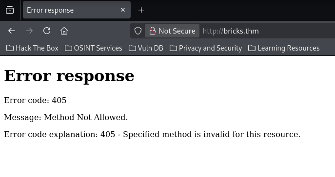
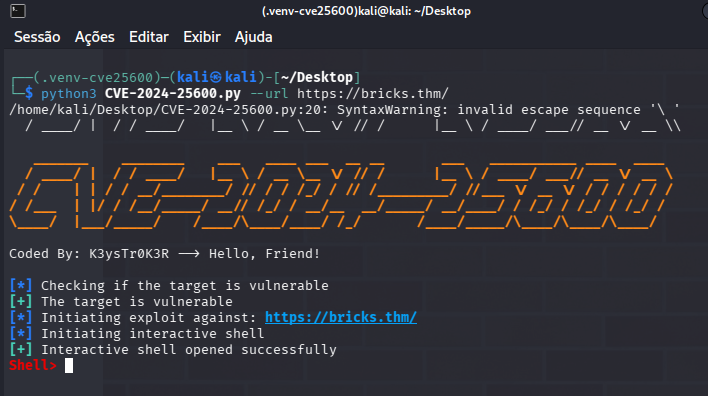
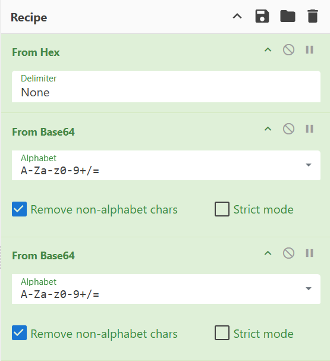
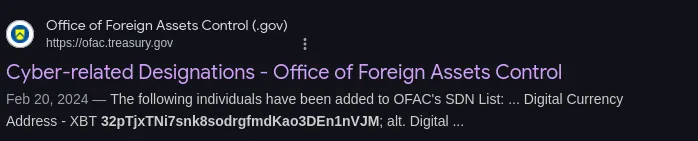

# TryHack3M: Bricks Heist

> Crack the code, command the exploit! Dive into the heart of the system with just an RCE CVE as your key.

Essa é a descrição da máquina hahaha. Vamos pra cima!

***

## Recon  

Recebemos o IP `10.65.138.10`.

Primeiro passo: testar comunicações e verificar o que temos rodando.

```bash
┌──(kali㉿kali)-[~]
└─$ ping 10.65.138.10
PING 10.65.138.10 (10.65.138.10) 56(84) bytes of data.
64 bytes from 10.65.138.10: icmp_seq=1 ttl=255 time=242 ms
64 bytes from 10.65.138.10: icmp_seq=2 ttl=255 time=265 ms
^C
--- 10.65.138.10 ping statistics ---
2 packets transmitted, 2 received, 0% packet loss, time 1001ms
rtt min/avg/max/mdev = 242.244/253.665/265.087/11.421 ms
```

Depois disso, usei o `curl` para ver o que o servidor retorna:

```bash
┌──(kali㉿kali)-[~]
└─$ curl 10.65.138.10 
<!DOCTYPE HTML PUBLIC "-//W3C//DTD HTML 4.01//EN"
        "http://www.w3.org/TR/html4/strict.dtd">
<html>
  <head>
    <meta http-equiv="Content-Type" content="text/html;charset=utf-8">
    <title>Error response</title>
  </head>
  <body>
    <h1>Error response</h1>
    <p>Error code: 405</p>
    <p>Message: Method Not Allowed.</p>
    <p>Error code explanation: 405 - Specified method is invalid for this resource.</p>
  </body>
</html>
```

Nesse momento, deixei o **nmap** rodando e aproveitei para configurar o **/etc/hosts**:

```bash
┌──(root㉿kali)-[/home/kali]
└─# echo "10.65.138.10 bricks.thm" >> /etc/hosts
```

Aproveitando esse momento, acessei o domínio `bricks.thm`.

Recebi um **erro 405**:



Por outro lado, o **nmap** retornou o seguinte resultado:

```bash
┌──(root㉿kali)-[/home/kali]
└─# nmap -sV -n -sS 10.65.138.10 -T5
PORT     STATE SERVICE  VERSION
22/tcp   open  ssh      OpenSSH 8.2p1 Ubuntu 4ubuntu0.11 (Ubuntu Linux; protocol 2.0)
80/tcp   open  http     Python http.server 3.5 - 3.10
443/tcp  open  ssl/http Apache httpd
3306/tcp open  mysql    MySQL (unauthorized)
Service Info: OS: Linux; CPE: cpe:/o:linux:linux_kernel
```

***

## Exploração  

Seguindo a dica: `What is the content of the hidden .txt file in the web folder?`

Poderia usar um scanner, mas decidi ir pelo modo manual.

Identificamos a versão do **WordPress**:


Pesquisei no Google por exploit dessa versão e encontrei este repositório:  
[K3ysTr0K3R — CVE-2024-25600 Exploit](https://github.com/K3ysTr0K3R/CVE-2024-25600-EXPLOIT/blob/main/CVE-2024-25600.py)

Instalei os requisitos com:

```bash
sudo apt update
sudo apt install python3-requests python3-bs4 python3-prompt-toolkit python3-rich
```

E rodei o script com:

```bash
python3 CVE.py -u https://bricks.thm
```

#### E voilà!



***

## Initial Access  

Respondendo às perguntas:

> What is the content of the hidden .txt file in the web folder?

```bash
Shell> ls
650c844110baced87e1606453b93f22a.txt
```

> What is the name of the suspicious process?

Dica: é um minerador 
Use:

```bash
ps -ef
```

> What is the service name affiliated with the suspicious process?

```bash
systemctl list-units --type=service
```

> What is the log file name of the miner instance?

Confesso que travei um pouco aqui 😂  
Mas encontrei a dica no diretório:

```bash
cd /lib/NetworkManager
```

> What is the wallet address of the miner instance?

Está presente no arquivo localizado nesse diretório.




> The wallet address used has been involved in transactions between wallets belonging to which threat group?




***

## Aprendizados  

- Senhas do WordPress são salvas em `wp-config.php`  
- Fixação de processos: `ps -ef`, `ps -a`, e `systemctl list-units --type=service`  
- Uso do **CyberChef** para análise e decodificação  
- Uso de **reverse shell** (revShell) para manutenção do acesso  
