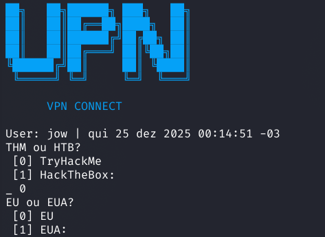

# VPN Connect
Este script tem como objetivo **facilitar a conexão VPN** em ambientes de estudo, labs e CTFs,
como **TryHackMe** e **Hack The Box**.

Ele pode ser adaptado para qualquer laboratório ou VPN, respeitando sempre a **licença aplicada**
ao serviço utilizado.


## Pré-requisitos:
- `openvpn`

- `bash` (ou shell compatível)

- `sudo` (ou root)

- `git`
## Configurando e instalando:   

        git clone https://github.com/rv157244/writeups/sc_vpn.git

        unzip sc_vpn.zip

        cd sc_vpn

Edite o Script Shell colocando o nome dos seus file .ovpn

        chmod 110 vpn

        sudo mv vpn /usr/local/bin/vpn

        mkdir ~.vpn

Feito isso é só mover os arquivos .ovpn para seu diretorio oculto (.vpn).

        chmod 440 ~/.vpn

Rode o script: 
```BASH
vpn
```
### Capturas de tela:


